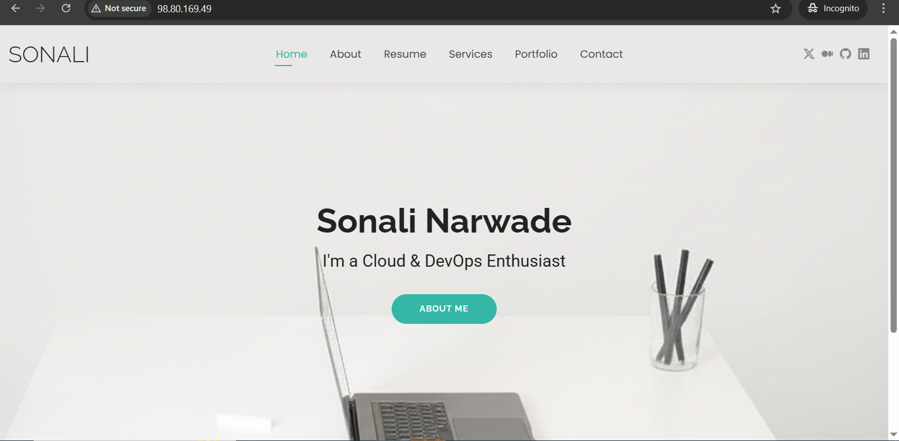

# 🚀 Containerizing My Portfolio Application with Docker

In this guide, I’ll walk you through how I containerized my portfolio application using **Docker** and deployed it on an **EC2 Linux server**.  
By the end, you’ll understand how to package your application, run it in a Docker container with Nginx, and push it to Docker Hub for future use.

---
##  Prerequisites

Before starting, make sure you have:

- An **AWS EC2 instance** (Linux) running.  
- **Docker installed** on the EC2 instance.  
- **Security Group** updated to allow inbound traffic on **port 80**.  
- Your **portfolio project folder** (static HTML, CSS, JS).  

---

##  Why Containerize a Portfolio?

A portfolio website is usually built with static files (HTML, CSS, JS). Running it locally is easy, but deploying it consistently across environments can be tricky. Docker helps us by:

- Packaging the app into a **lightweight container**.
- Ensuring **consistency** between local and server environments.
- Making deployment **fast and portable**.

---

##  Steps to Containerize and Deploy

### **1. Copy Portfolio Application to EC2 Server**

Transfer project folder (`portfolio-sonali/`) from local machine to Linux server:

```bash
scp -i pem-server-key.pem -r portfolio-sonali/ ec2-user@98.80.169.49:/home/ec2-user/
```

This securely copies the directory to `/home/ec2-user/` on the server.

---

### **2. SSH into the Server**

Log into EC2 instance:

```bash
ssh -i "pem-server-key.pem" ec2-user@ec2-98-80-169-49.compute-1.amazonaws.com
```

---

### **3. Run an Nginx Container**

Run Nginx to serve static portfolio files:

```bash
docker run -d -p 80:80 nginx
```

- `-d` → run in detached mode (background)  
- `-p 80:80` → map container port `80` to server port `80`  
- `nginx` → official Nginx image  

---

### **4. Copy Portfolio Files into the Container**

Copy portfolio into Nginx’s web root:

```bash
sudo docker cp portfolio-sonali/ 019bb9c4b472:/usr/share/nginx/html
```

- `portfolio-sonali/` → local project directory  
- `019bb9c4b472` → container ID (find using `docker ps`)  

---

### **5. Access the Container (Optional)**

To explore/make manual changes:

```bash
docker exec -it 019 /bin/bash
```

---

### **6. Configure Nginx**

Inside container:

```bash
cd /etc/nginx/conf.d/
apt update
apt install vim -y
```

Edit `default.conf` to point correctly to portfolio directory.

---

### **7. Restart the Container**

Stop and restart container to apply changes:

```bash
docker stop 019bb9c4b472
docker start 019bb9c4b472
```

Now portfolio is served at **EC2 public IP:80**.

---

### **8. Push Custom Image to Docker Hub**

- Commit container as image:

```bash
docker commit 019bb9c4b472 my-portfolio-image
```

- Tag image:

```bash
docker tag my-portfolio-image narwadesonali7/portfolio-sonali:latest
```

- Login & push:

```bash
docker login
docker push narwadesonali7/portfolio-sonali:latest
```

Run portfolio anywhere:

```bash
docker run -d -p 80:80 narwadesonali7/portfolio-sonali:latest
```

---

##  Final Result

- Portfolio live on **EC2 server**, containerized with **Docker**  
- Image reusable via **Docker Hub**  
- Deployment now **consistent, fast, and reliable**  

---

##  Key Takeaways

- `scp` → securely copy files to server  
- `docker run` → start a container from an image  
- `docker cp` → copy files into container  
- `docker exec` → enter a container  
- `docker commit`, `docker tag`, `docker push` → save & publish images  

---


 With this setup, my portfolio is no longer tied to one machine . it can run on **any server** that supports Docker!
